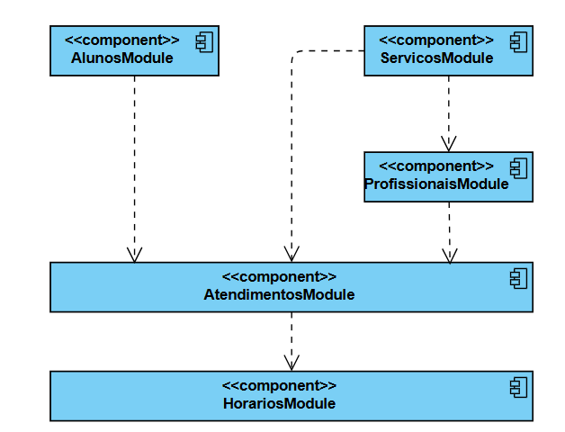
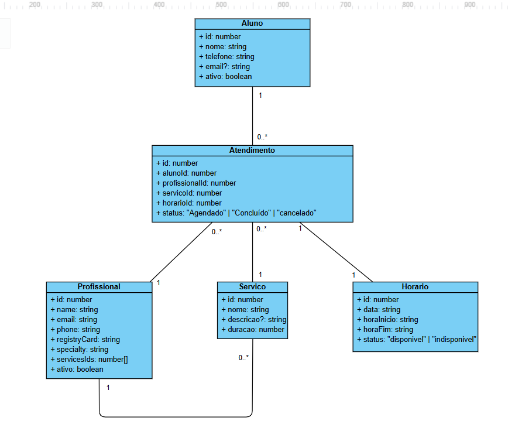

# 📚 Projeto Clínica-Escola

Projeto final da disciplina de Desenvolvimento Web Back-end.

---

## 🧩 Problema

Desenvolver uma **agenda de atendimentos para uma clínica-escola**, permitindo o gerenciamento de:

- Profissionais
- Pacientes
- Serviços
- Horários
- Atendimentos

O sistema deve lidar com:

- Conflitos de agenda
- Confirmação e cancelamento de atendimentos
- Regras de disponibilidade

⚠️ Observação: o projeto não utiliza dados reais ou sensíveis de saúde.

---

## 👥 Integrantes

<div>
  <a href="https://github.com/IngridyCandido">Ingridy Luzia Silva Candido</a><br/>
  <a href="https://github.com/zehelll">Jose Henrique Aviz de Farias</a><br/>
  <a href="https://github.com/nicoletsi">Nicole Gabriel Lucena de Carvalho</a><br/>
  <a href="https://github.com/guipaulo">Paulo Guilherme Silva de Araújo</a>
</div>

---

## 🏗️ Arquitetura

O projeto segue a arquitetura modular do **NestJS**, com separação por responsabilidades:

- Módulos independentes por domínio (ex: usuários, autenticação, agendamentos)
- Controllers responsáveis pelas rotas HTTP
- Services contendo a regra de negócio
- Guards para controle de autenticação e autorização

---

### 🏛️ Diagrama de Arquitetura (Componentes)
Este diagrama representa a estrutura física e as dependências entre os módulos da API:




## 📊 Modelo de Dados e Entidades (Diagrama de Classes)

Abaixo está o mapeamento de entidades que estruturam as informações do sistema e suas relações para viabilizar um agendamento:



---

## 🛠️ Tecnologias

- Node.js
- NestJS
- TypeScript
- Passport.js
- Passport Local Strategy
- class-validator
- class-transformer

---

## ▶️ Como executar o projeto

1. Clonar o repositório
```bash
git clone https://github.com/seu-repositorio/api-clinica-escola.git
```
1. Clonar o repositório
```bash
git clone https://github.com/seu-repositorio/api-clinica-escola.git
```
2. Entrar na pasta
```bash
cd api-clinica-escola
```
3. Instalar dependências
```bash
npm install
```
4. Rodar o projeto
```bash
npm run start:dev
```
A API estará disponível em:
```bash
http://localhost:3000
```
## Variáveis de ambiente 
- JWT_SECRET=sua-chave-aqui

## Decisões técnicas
- NestJS: escolhido pela arquitetura escalável e modular
- Passport: padrão consolidado para autenticação
- class-validator: validação declarativa e integrada ao NestJS
- Modularização: separação entre modulos para organização e manutenção
- Guards: controle de acesso desacoplado da lógica de negócio

## 🌿 Estrutura de Branches

Para manter o desenvolvimento organizado e evitar conflitos diretos na linha de produção, o grupo utilizou o modelo de ramificação **Feature Branches**. Cada integrante trabalhou em sua própria branch antes da integração final na ramificação principal.

### `main`

Código estável, integrado e homologado do projeto.

### `nicoletsi` — Nicole Gabriel

- **Backend:** Desenvolveu os CRUDs de alunos e profissionais.
- **Refatoração:** Liderou a migração da arquitetura de "pacientes" para "alunos", ajustando DTOs e entidades.
- **Integração:** Limpou redundâncias de status nos módulos de horários e serviços.
- **Resolução de conflitos:** Resolveu conflitos críticos de mesclagem no arquivo `app.module.ts` e no gerenciador de pacotes.
- **Deploy:** Participou da publicação da aplicação na nuvem utilizando o **Render**, realizando a configuração e a disponibilização dos serviços.

### `ingridy` — Ingridy Luzia

- **Backend:** Implementou os módulos de autenticação e usuários.
- **Criptografia:** Implementou a criptografia de senhas utilizando **Bcrypt**, incluindo o arquivo `gerar-hashes.ts`.
- **Autenticação:** Desenvolveu o sistema de autenticação utilizando **JWT**.
- **Cookies:** Implementou o gerenciamento de autenticação por meio de cookies.
- **Paginação:** Adicionou suporte à paginação nas consultas da aplicação.
- **CORS:** Realizou a configuração do **CORS** para permitir a comunicação entre o frontend e o backend.
- **Frontend:** Desenvolveu a interface web de login na pasta `cliente-auth`, utilizando HTML, CSS e JavaScript puro.

### `jose` — José Henrique

- **Backend:** Desenvolveu os módulos de serviços e horários.
- **Consultas:** Implementou métodos de busca por ID, como `buscarPorId`.
- **Integração:** Estabilizou o fluxo inicial de agendas e integrou os módulos ao módulo principal da aplicação.
- **Diagramas:** Criou os diagramas de classes e de arquitetura do sistema.
- **Swagger:** Criou e organizou a documentação dos endpoints da API utilizando o **Swagger**.
- **Deploy:** Participou da publicação da aplicação na nuvem utilizando o **Render**, realizando a configuração e a disponibilização dos serviços.

### `guipaulo` — Paulo Guilherme

- **Backend:** Desenvolveu o módulo de atendimentos.
- **Filtros:** Implementou a lógica de filtros de busca por meio do arquivo `filtro-atendimento.dto.ts` e do decorator `@Query`.
- **Retornos HTTP:** Ajustou os códigos e retornos HTTP das rotas da aplicação.
- **Integração:** Trabalhou na refatoração e na integração geral dos módulos da API durante o fechamento do projeto.
- **Infraestrutura:** Estruturou o ambiente de desenvolvimento utilizando **Docker**, por meio dos arquivos `Dockerfile` e `docker-compose.yml`.
- **Qualidade:** Realizou a verificação de bugs e inconsistências do sistema, auxiliando na identificação e na correção de problemas antes da integração final.


## 🚀 Links do Projeto Publicado

| Componente | Descrição | Link de Acesso |
|------------|-----------|----------------|
| 💻 **Frontend** | Interface visual completa (telas de login, aluno, profissional e administrador). | **[Acessar o Sistema](https://projeto-clinica-escola.onrender.com/html/index.html)** |
| ⚙️ **Backend & API** | Servidor **NestJS** integrado e hospedado no **Render**. | **[Acessar Servidor](https://projeto-clinica-escola.onrender.com/)** |
| 📖 **Documentação (Swagger)** | Documentação interativa da API com todos os endpoints disponíveis para consulta e testes. | **[Ver Swagger](https://projeto-clinica-escola.onrender.com/api)** |